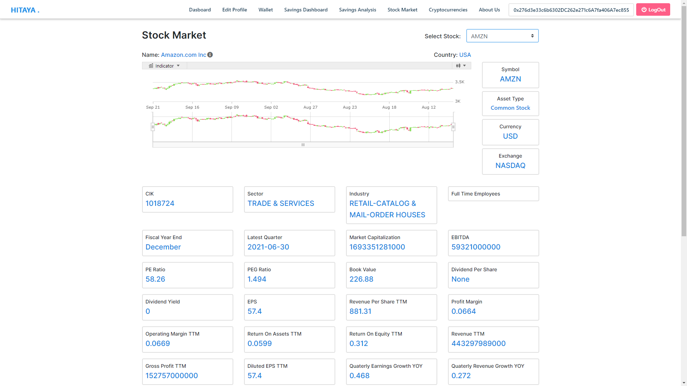
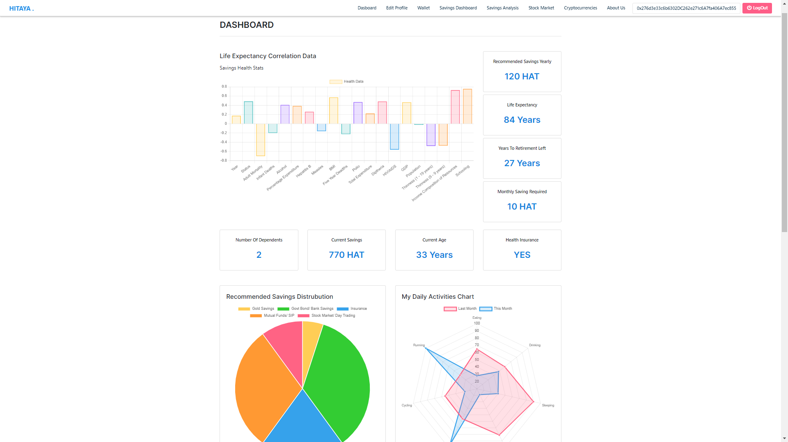

<h1 align="center">HITAYA</h1>
<p><strong>Banking, Finance and Investment –</strong> Reinvent the financial services experience and unlock new opportunities to empower intelligent banking, secured payment processing, modernize trading, and personalize insurance software systems. With Azure, financial organizations have the infrastructure and security to take customer experiences to the next level. 

How can you utilize Azure  to empower banks, capital markets, and insurance firms to provide next-generation experiences for customers, improve regulatory compliance, manage risk, and reduce waste? Submit ideas to personalize customer experiences, modernize financial systems and optimize risk management.</p> 


<h3>Key Features</h3>
<ul>
  <li>Introduced Machine Learning for Life Expectancy and Wealth Analysis.</li>
  <li>Proper Financila Planning for Retirement and Old Age.</li>
  <li>Visual and Detailed Displays with Analysis.</li>
  <li>Charts and Graphs for enhanced calculations</li>
  <li>Management Flow.</li>
  <li>Realtime Cash Flows, Statements, Investments and Retirement monetary values</li>
</ul>

After it receives certain necessary inputs from user (i.e. current age, salary, health related info, etc), it will show all the required information including graphs and charts for better view and financial controls. It also uses Machine Learning to improve for more better investments.

<br />
<br />

<h1>THEME: Banking, Finance and Investment</h1>
<p><strong>Including solutions that support retirement planning for longer lives or protect against financial abuse.</strong></p>

```
It is a Web Based Project that requires a browser and internet connection to be operable.

Some Examples -

  1. Savings
  2. Stock Investments
  3. Savings and Investments Analysis for Old Age.
  4. To have enough wealth for secure retirement and still have your pleasures during old age.

On front end -
  1. Receives inputs through a form from user.
  2. Calculates and Displays the data and other information including visual charts.
  3. Realtime data analysis calculator.

On back end -
  1. Machine Learning Model that predicts Life Expectancy from certain parameters and also total wealth calculation.
  2. Realtime Calculation for Realtime Analysis Calculator.

```

# INVESTOPIA WORKING SAMPLE

For video demostration refer to the YouTube link <a href="https://www.youtube.com/watch?v=wVqjilbKox8&t=2s">here.</a> 


<p align="center">
    
    <br>
    <sup><a href="https://github.com/raj713335/INVESTOPIA" target="_blank"><strong>INVESTOPIA</strong></a></sup>
</p>


# HITAYA APPLICATION SCREENSHOTS

<br />


<br />


<br />


<br />


<br />


<br />


<br />

<br />


<br />

<br />


<br />

<br />




<br />

<br />


<br />

<br />


<br />

<br />


<br />

<br />




<br />


<br />


<br />

<br />


<br />


<br />


<br />


<h1>Project Requirements</h1>

<h4>Languages</h4>
<ul>
  <li>JavaScript/TypeScript</li>
  <li>Python 3</li>
  <li>C#</li>
</ul>

<h4>Frameworks</h4>
<ul>
  <li>Angular 9</li>
  <li>BootStrap 4.6</li>
  <li>Chart.js 3.1</li>
  <li>ASP .NET CORE WEB API</li>
</ul>

<h1>Getting Started</h1>
<p><strong>Clone the repo</strong></p>

```
  $ git clone https://github.com/raj713335/Hitaya.git
  $ cd Hitaya
```

## Running ASP .NEW CORE WEB API APPLICATION
	
	Run HITAYA_TSQL.sql script present in the project root directory

## Running ASP .NEW CORE WEB API APPLICATION
	
	From Folder Hitaya.ServiceLayer


## Installing Python ML Module

```
  - Install Python 3.7.3 and its required Packages like tensorflow etc.
 
  $ pip install numpy
  $ pip install scipy
  $ pip install scikit-learn
  $ pip install matplotlib
  $ pip install pandas
  $ pip install fastapi
  $ pip install uvicorn
  $ pip install gunicorn==19.9.0
  $ pip install uvloop
  $ pip install httptools
```

- Run the app

```sh
$ python Hitaya/ML Components/ocr.py
```

# Angular
This project was generated with [Angular CLI](https://github.com/angular/angular-cli) version 11.0.6.

## Development server

Run `ng serve` for a dev server. Navigate to `http://localhost:4200/`. The app will automatically reload if you change any of the source files.

## Code scaffolding

Run `ng generate component component-name` to generate a new component. You can also use `ng generate directive|pipe|service|class|guard|interface|enum|module`.

## Build

Run `ng build` to build the project. The build artifacts will be stored in the `dist/` directory. Use the `-prod` flag for a production build.

## Running unit tests

Run `ng test` to execute the unit tests via [Karma](https://karma-runner.github.io).

## Running end-to-end tests

Run `ng e2e` to execute the end-to-end tests via [Protractor](http://www.protractortest.org/).

## Further help

To get more help on the Angular CLI use `ng help` or go check out the [Angular CLI README](https://github.com/angular/angular-cli/blob/master/README.md).
## Installing Angular and other Libraries
	
	Go insisde HitayaApp folder and run `ng serve -o`

```
  Angular Packages used :
 
  $ npm install chart.js
  $ npm install jquery
  $ npm install bootstrap font-awesome
  $ npm install bootstrap@next
  $ npm install ngx-captcha
  $ npm install --save igniteui-angular-core
  $ npm install --save igniteui-angular-charts
  $ npm install web3 --save
  $ npm install @truffle/contract@4.1.0
```

<p>Run the App</p>

```
  $ ng serve -o
```


<h2>That's it!</h2>
