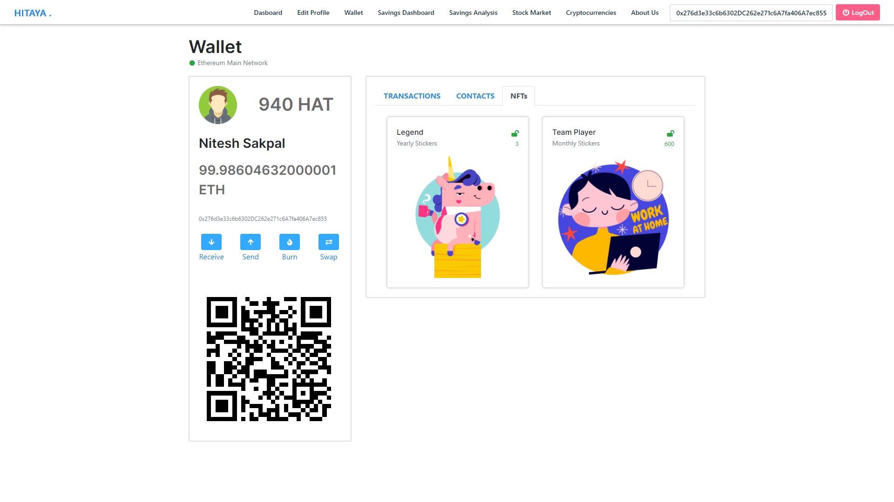
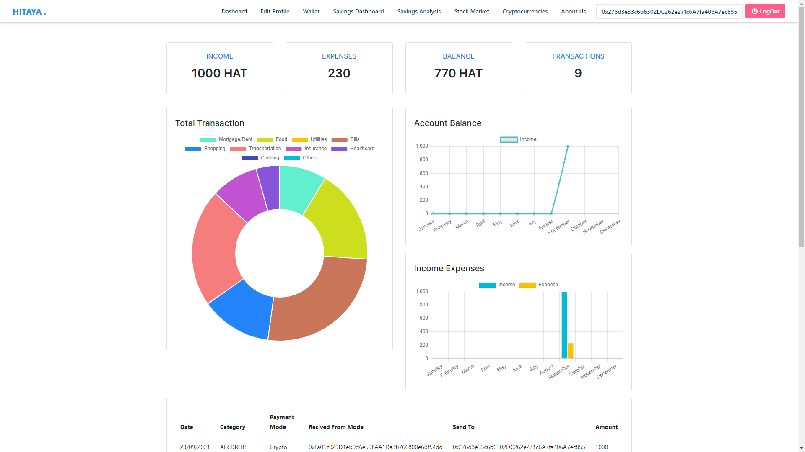

<h1 align="center">HITAYA</h1>
<p><strong>Employee Welfare DApp –</strong> Hitaya is derived from a Sanskrit word which means Welfare.
	
Hitaya DApp primary focus is to enable users belonging to an organization to transfer tokens or (HAT Tokens) which will be widely accepted in the organization as a form of coupons/currency in organization canteen, gyms or malls, or users can transfer this tokens among its peers or swap it with other tokens or currency, save contacts in blockchain, and view income/expenditure in a dashboard.
	
<strong>Dapp Admin –</strong>can change the Employee Administrator, Mint Token, Burn Tokens, Transfer Tokens or can view Transaction Details , or User Details.

<strong>Employee Admin –</strong>Can add new employee to the blockchain via samrtContract and view all Employee details stored in blockchain.

Dapp Users can use tokens during a purchase of items or to transfer HAT Tokens among Employees. </p> 


<h3>Key Features</h3>
<ul>
  <li>Mint Tokens</li>
  <li>Transfer Tokens</li>
  <li>Burn Tokens</li>
  <li>View Transaction Details and Dashboard</li>
  <li>View Employee Details</li>
  <li>View Stock Market details</li>
  <li>View Crypto Market details</li>
  <li>Recommendation System for Wealth Management</li>
  <li>Retirement Savings Calculator</li>
</ul>


<br />
<br />


# HITAYA WORKING SAMPLE

For video demostration refer to the YouTube link <a href="https://www.youtube.com/watch?v=MOR_yGGBq1Y">here.</a> 


<p align="center">
    
    <br>
    <sup><a href="https://github.com/raj713335/Hitaya" target="_blank"><strong>HITAYA</strong></a></sup>
</p>


# HITAYA WALLET APPLICATION SCREENSHOTS

<br />
<p align="center">
	
	
	
	
	
	
	
	
	
	
	
	
	
	
	
	
</p>
<br />


# HITAYA FINANCE SCREENSHOTS

Hitaya Finance can be used to get soft loans from other peers/colleague/friends belonging to the same organization.


<h3>How Hitaya Finance works ?</h3>
<ul>
  <li>A user can ask for loan (HAT Tokens) from his colleague/friend within an organization at a fixed interest rate.</li>
  <li>The Colleague can accept/reject/negotiate the interest rate and the timeline of the loan repayment.</li>
  <li>If both parties agree a loan is sanctioned from the smart contract.</li>
  <li>And the loan repayment is done by the deducting the amount from monthly salary of the employee after calculating the Monthly payment from the Time, and Interest Rate of loan Repayment.</li>
  <li>All benefit from the agreement as the loan taker can get a lower interest rate on loan, than been charged by the traditional banking System.</li>
  <li>And the loan giver can earn a higher interest on their money, than saving it in the traditional banks systems.</li>
</ul>

<br />
<p align="center">
	
	
	
</p>
<br />

# HITAYA HEALTHCARE SCREENSHOTS

<br />
<p align="center">
	
</p>
<br />


<h1>Project Requirements</h1>

<h4>Languages</h4>
<ul>
  <li>JavaScript/TypeScript</li>
  <li>Python 3</li>
  <li>C#</li>
</ul>

<h4>Frameworks</h4>
<ul>
  <li>Angular 11</li>
  <li>BootStrap 4.6</li>
  <li>ASP .NET CORE WEB API</li>
  <li>Truffle</li>
</ul>

<h1>Getting Started</h1>
<p><strong>Clone the repo</strong></p>

```
  $ git clone https://github.com/raj713335/Hitaya.git
  $ cd Hitaya
```

<!-- ## Running ASP .NEW CORE WEB API APPLICATION
	
	Run HITAYA_TSQL.sql script present in the project root directory

## Running ASP .NEW CORE WEB API APPLICATION
	
	From Folder Hitaya.ServiceLayer
 -->

## Installing Python ML Module

```
  - Install Python 3.7.3 and its required Packages like tensorflow etc.
 
  $ pip install -r requirements.txt
```

- Run the app

```sh
$ python Hitaya/ML Components/app.py
```

# Angular
This project was generated with [Angular CLI](https://github.com/angular/angular-cli) version 11.0.6.

<!-- ## Development server

Run `ng serve` for a dev server. Navigate to `http://localhost:4200/`. The app will automatically reload if you change any of the source files.

## Code scaffolding

Run `ng generate component component-name` to generate a new component. You can also use `ng generate directive|pipe|service|class|guard|interface|enum|module`.

## Build

Run `ng build` to build the project. The build artifacts will be stored in the `dist/` directory. Use the `-prod` flag for a production build.

## Running unit tests

Run `ng test` to execute the unit tests via [Karma](https://karma-runner.github.io).

## Running end-to-end tests

Run `ng e2e` to execute the end-to-end tests via [Protractor](http://www.protractortest.org/).

## Further help

To get more help on the Angular CLI use `ng help` or go check out the [Angular CLI README](https://github.com/angular/angular-cli/blob/master/README.md). -->

## Installing Truffle Suite for Local Smart contract deployment 

	Install Ganache and start the local blockchain
```
  $ cd truffle
  $ npm install -g truffle
  $ truffle compile
  $ truffle migrate
  $ truffle migrate — network development
  $ truffle console --network development
```

## Installing Angular and other Libraries

```
  $ cd HitayaApp
  $ npm update
```
	
<!-- 	Go insisde HitayaApp folder and run `ng serve -o` -->

```
  Angular Packages used :
 
  $ npm install chart.js
  $ npm install jquery
  $ npm install bootstrap font-awesome
  $ npm install bootstrap@next
  $ npm install ngx-captcha
  $ npm install --save igniteui-angular-core
  $ npm install --save igniteui-angular-charts
  $ npm install web3 --save
  $ npm install @truffle/contract@4.1.0
```

<p>Run the App</p>

```
  $ ng serve -o
```


<h2>That's it!</h2>
